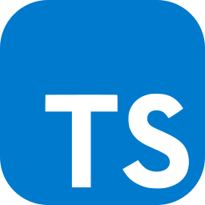
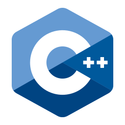
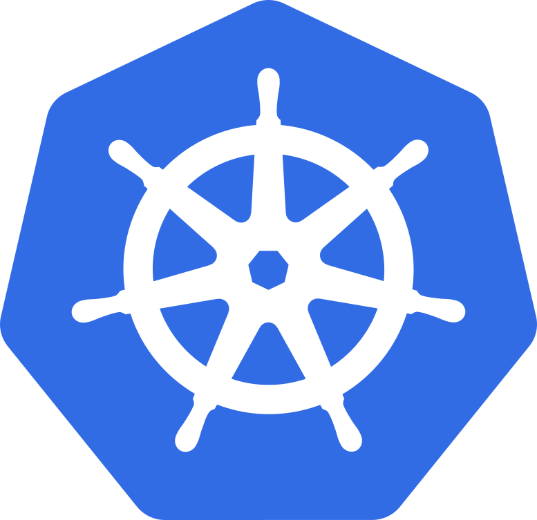

# Hi, I'm [sixteen] 👋

### About Me 🚀

- 🤖 I'm passionate about **Artificial Intelligence**, **Machine Learning**, and **Data Science**.
- 🌱 Currently learning **Python**, **C** and **R**.
- 📫 How to reach me: **[email](mailto:250218lxl@gmail.com)**

### Technologies I Use 💻

- **Languages**

  
  
  

- **Tools**

     

### My Interests 🌟

- 🏓 Table Tennis
- 🎮 Video Gaming
- 🎸 Music

### Visitors 👀

